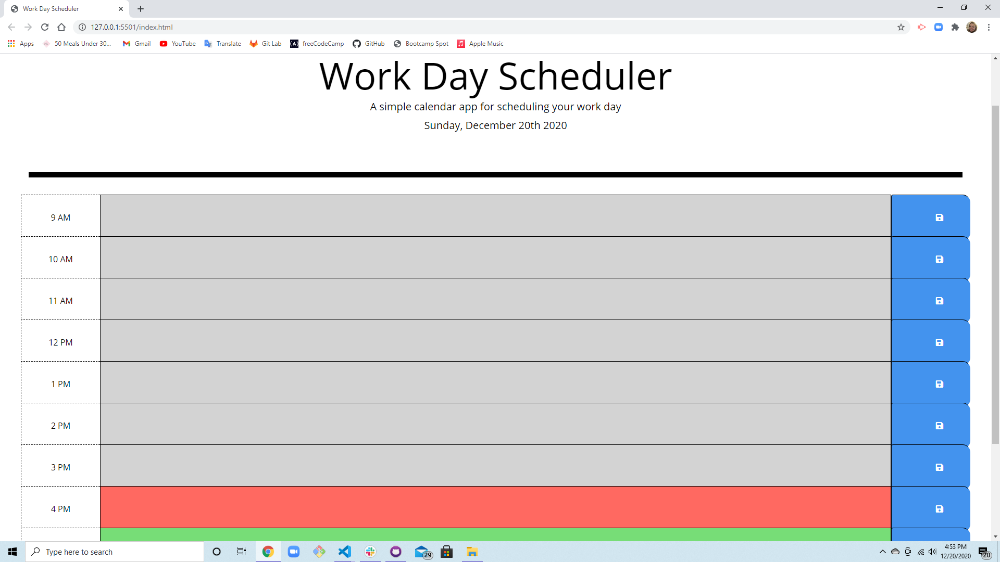

# Homework-Week5

Screenshot:

Description:

We were given the starter code for this project so the first thing I did was make the rest of the rows and text inputs for the planner. I attached a save button to the end of every row. I then linked all of the classes to variables in my script file and began to create the functions to have them save to local storage once the save button was clicked and created the function to contain today's date at the top of the page. I also wrote the function to have the color change according to the time of day with conditional statements for each slot. I changed some of the CSS styles (that were provided) to make it look how I wanted. 

Link to deployed application:

https://todtsies.github.io/Homework-Week5/